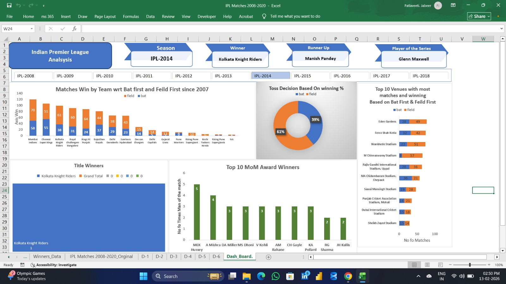

# IPL-Analysis-Dashboard-Excel
An interactive IPL Analysis Dashboard built with Excel using Pivot Tables, Slicers, and Power Query.

# IPL Analysis Dashboard (2008 - 2022)

## Project Overview
This project is a comprehensive analysis of IPL data using Microsoft Excel. It provides insights into team performances, player statistics, and match outcomes through an interactive dashboard.

## Key Features
* **Interactive Slicers:** Filter data by Season and Team.
* **KPI Indicators:** High-level metrics for Winners, Runners-up, and Player of the Series.
* **Data Visualization:** Charts showing match wins, toss decisions, and venue stats.

## Tools Used
* **Microsoft Excel** (Pivot Tables, Pivot Charts, Slicers)
* **Power Query** (Data Cleaning and Transformation)

## Screenshot

